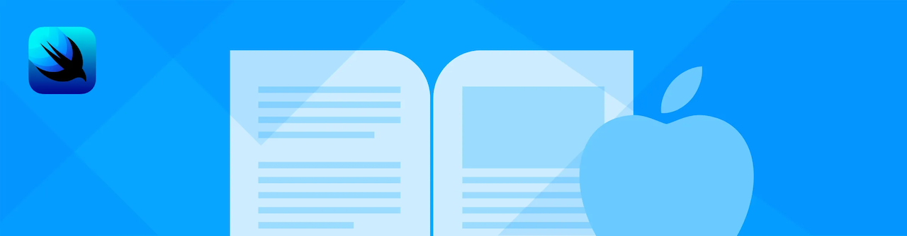
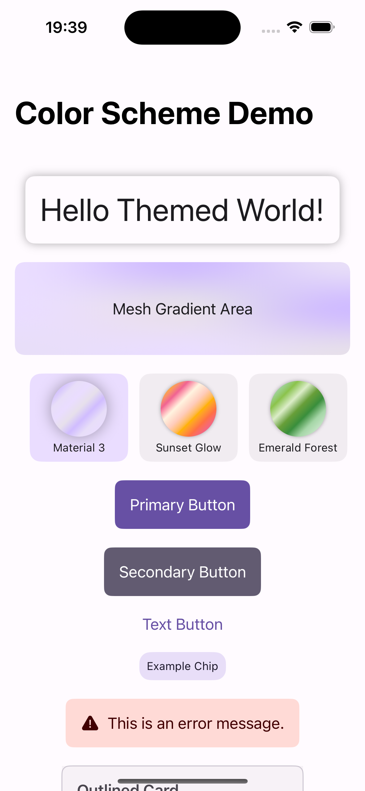

# Themeable

Themeable is a SwiftUI demonstration app showcasing a structured, dynamic, and easily maintainable theming architecture. It enables developers to implement and manage themes seamlessly across SwiftUI apps, significantly simplifying theme integration, switching, and scalability.

Full details and insights into the architecture and implementation are available on my blog:
[Introducing Themeable: A SwiftUI Theming Demo App](https://cashoefman.com/introducing-themeable-a-swiftui-theming-demo-app)

## Screenshot



## Key Features

* **Dynamic Theme Switching:** Easily toggle between multiple predefined themes.
* **Scalable Architecture:** Clean separation of concerns ensuring maintainability and ease of expansion.
* **Structured Theming:** Centralized theme management to ensure consistency and simplicity across views.
* **Customizable Themes:** Define your own theme attributes for color, typography, layout, and more.

## Project Structure

The Themeable app follows a simple yet robust architecture:

```
Themeable/
├── Coordinators/
│   └── AppCoordinator.swift
├── Models/
│   ├── ThemeData.swift
│   ├── ThemeID.swift
│   └── ThemeProtocol.swift
├── ViewModels/
│   └── ThemeManager.swift
├── Views/
│   └── ContentView.swift
├── Themes/
│   └── ThemeImplementations.swift
├── Utils/
│   ├── ColorSchemeTracker.swift
│   ├── EnvironmentValues+Themer.swift
│   ├── Themer.swift
│   └── UserDefaults+Theme.swift
├── SupportingFiles/
│   └── ThemeableApp.swift
├── ThemeableTests/
│   └── ThemeableTests.swift
└── ThemeableUITests/
    ├── ThemeableUITests.swift
    └── ThemeableUITestsLaunchTests.swift
```

## Getting Started

### Installation

Clone the repository and open the project in Xcode 16.3 or later:

```bash
git clone https://github.com/cashoefman/Themeable.git
cd Themeable
open Themeable.xcodeproj
```

### Running the Project

Build and run the project on the iOS Simulator or a physical device running iOS 18 or later.

## Customizing Themes

To create a new theme:

1. Add a new Swift file in the `Themes` directory, for example, `CustomTheme.swift`.
2. Define your theme by implementing the required properties from the `Theme` protocol.
3. Update `ThemeManager.swift` to include your new theme in the list of available themes.

Example:

```swift
import SwiftUI

struct CustomTheme: Theme {
    var primaryColor: Color = .purple
    var secondaryColor: Color = .pink
    var backgroundColor: Color = .black
    var textColor: Color = .white
}
```

## Contributing

Contributions to Themeable are welcome! Please fork the repository, make your changes, and submit a pull request.

## License

This project is licensed under the MIT License. See the `LICENSE` file for details.
