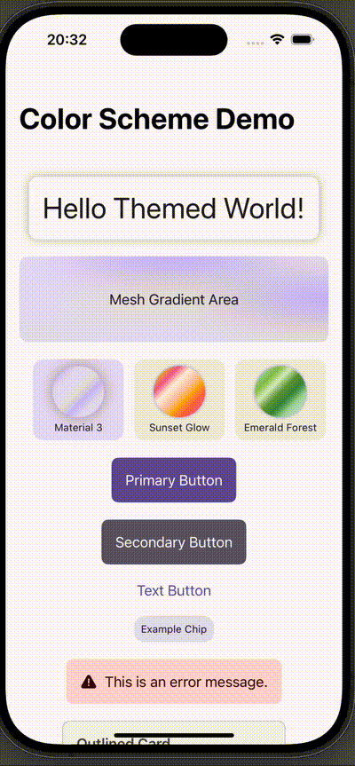

# Themeable

Themeable is a powerful yet straightforward SwiftUI demonstration app that showcases dynamic, scalable, and easily maintainable theming architectures. This app simplifies the integration, management, and switching of themes within SwiftUI applications, leveraging best practices for clean, maintainable code.

Explore the detailed implementation on my blog:
[Introducing Themeable: A SwiftUI Theming Demo App](https://cashoefman.com/introducing-themeable-a-swiftui-theming-demo-app)

## Key Features

## Screenshot



* **Dynamic Theme Switching:** Instantly switch between multiple predefined themes at runtime.
* **Custom Themes:** Define, customize, and manage themes with ease through structured JSON configurations.
* **Adaptive UI:** Themes automatically adapt to device color schemes (light and dark modes).
* **Persistent User Preferences:** User-selected themes are persisted across sessions seamlessly.
* **Structured Theming:** Clearly defined theme protocols and JSON-based theme definitions ensure scalability and consistency.

## Project Structure

```plaintext
Themeable/
├── Models/
│   ├── ThemeData.swift
│   ├── ThemeID.swift
│   └── ThemeProtocol.swift
├── ViewModels/
│   └── ThemeManager.swift
├── Views/
│   └── ContentView.swift
├── Themes/
│   └── ThemeImplementations.swift
├── Utils/
│   ├── ColorSchemeTracker.swift
│   ├── EnvironmentValues+Themer.swift
│   ├── Themer.swift
│   └── UserDefaults+Theme.swift
├── SupportingFiles/
│   └── ThemeableApp.swift
├── Assets.xcassets/
│   ├── AccentColor.colorset
│   └── AppIcon.appiconset
├── Resources/
│   └── AppThemes.json
├── ThemeableTests/
│   └── ThemeableTests.swift
└── ThemeableUITests/
    ├── ThemeableUITests.swift
    └── ThemeableUITestsLaunchTests.swift
```

## Getting Started

### Installation

Clone the repository:

```bash
git clone https://github.com/cashoefman/Themeable.git
cd Themeable
open Themeable.xcodeproj
```

### Running the Project

* Open the project in Xcode 16.3 or later.
* Build and run on the iOS Simulator or a physical device running iOS 18 or later.

## Customizing Themes

Themes are defined and managed through JSON files (`AppThemes.json`). Each theme specifies color configurations for both light and dark modes, making it straightforward to add new themes or customize existing ones without changing the core app logic.

Here's a brief example of a theme JSON configuration:

```json
{
  "id": "custom.theme.id",
  "displayName": "Custom Theme",
  "lightColors": {
    "primary": "#6750A4",
    "onPrimary": "#FFFFFF",
    "background": "#FFFBFF",
    "onBackground": "#1C1B1F"
  },
  "darkColors": {
    "primary": "#D0BCFF",
    "onPrimary": "#381E72",
    "background": "#1C1B1F",
    "onBackground": "#E6E0E6"
  }
}
```

## Usage Examples

* **Switching Themes:** Easily select a new theme from the built-in carousel interface.
* **Persistent Settings:** Theme choices are automatically saved, ensuring user preferences persist across sessions.
* **Dynamic UI Adjustments:** UI elements like buttons, backgrounds, and text automatically reflect the chosen theme's color scheme.

## Contributing

Contributions to enhance Themeable are always welcome! Feel free to fork the repository, implement improvements or new features, and submit a pull request.

## License

Themeable is licensed under the MIT License. See the `LICENSE` file for more details.
